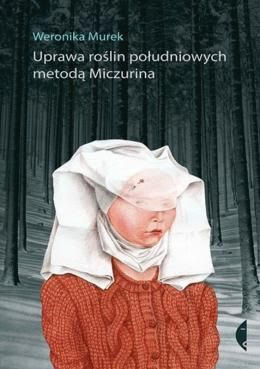

When the verbal body is not yet covered in graphic clothes: designers, illustrators, and typographers come to the rescue. They are responsible for the visual contact between the reader and the author.

Book design is not much different from other types of design. A lot depends on the type of publishing house: it is one thing to design fiction, and quite another — a textbook for school. Perhaps, the only common thing is that *someone will read the book*, and it is better to make it *not complicated* for the reader to understand the essence of the text.

In the 1990s, the Swiss typographer and author of works about design, Joost Hochul, formulated fourteen criteria for evaluating the book. Speaking about the correspondence of the font to the content, the proportions of text strips and illustrative ones, the printing method and the type of paper, and even about the "appropriate direction of paper fibres in the book block," he drew attention to the integrity and functionality. How to design such a book? Let's move on to the details.

Books are divided into those intended for reading and those intended for viewing. The rules relate primarily to the first since it is necessary to fulfil several ergonomics requirements: the text should be clear, visually easy to read, and should be designed in such a way that the appearance of the page corresponds to the content and emphasizes it.

Footnotes should be easily found on the page; titles should be more noticeable than the main text, diagrams and tables should be highlighted somehow, and so on. Moreover, all this is in order to enhance the effect of what you read. However, take a second to imagine how the reader will feel if the footnotes merge with the captions under the illustrations or the quotes which cannot be distinguished from the main text? A banality? Maybe. You begin to understand that negligence in executing these details can create complete chaos in the text and make the book difficult or even impossible to read.  

A book is primarily an object, a single whole. *All elements are equally important: typography, the arrangement of elements, colour and material, and not just the content itself.* We should not forget that a book lives in time-unlike an advertisement or a poster — and we evaluate its cover at least twice: in a bookstore and after reading it. Therefore, these are totally different perspectives.

Usually, the reader does not pay attention to the illustrator's work who cares about the comfortable perception of the text. While reading, we do not realize that enormous work has been done. First, the font size is significant. If it is too small, it will be difficult for a reader with weak eyesight to distinguish the words. If it is too large — the text will look ridiculous. Secondly, there is a line space. Again: if the space is too small, the lines will merge, and if the text is too large, it will lose coherence. Third, the fields. In the classic format, the lower fields are twice as broad as the upper ones, and the inner ones are twice as wide as the outer ones. Furthermore, this is only a tiny part of the details that escape the eyes of the stereotypical reader.

 

 

Now, let's analyze the value of the book illustration on the example of the cover of the collection of short stories by Veronika Murek, "Cultivation of southern plants by the Michurin method." A woman in a cap casts a dissatisfied glance at the reader as if outraged that someone dared to take her out of the frames of a painting by Rogier van der Weyden. At first glance, everything here is jarring: neither the sweater fits the lady, nor the lady to the forest, nor the title to the book, even the plot seems to be disconnected from reality — but this is exactly the expressive power of the image. The illustration by Ivona Khmelevskaya serves as an ideal bridge to the surreal world of the writer.

Therefore, it is obvious that there are many more people behind the book than just one author. The next time you pick up a book, you should think about the fact that a large group of people worked hard to convey the author's idea and meaning. Thus, we will realize a great idea - that making a book is the work of a whole big team on one integral work and not just the literary work of one person.