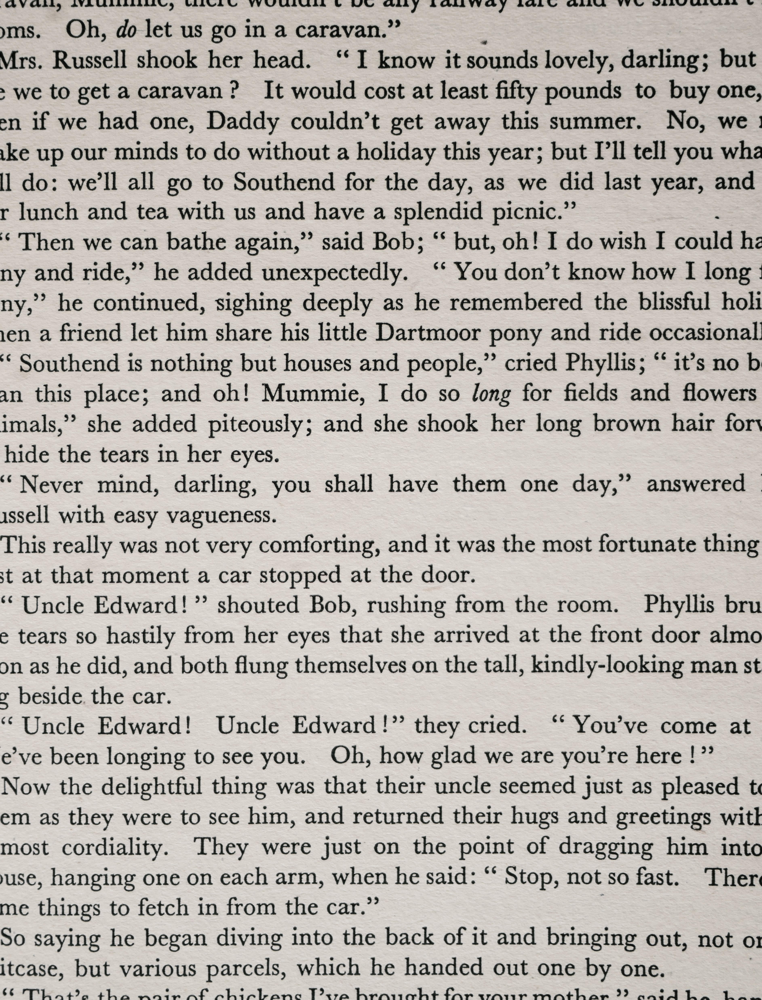
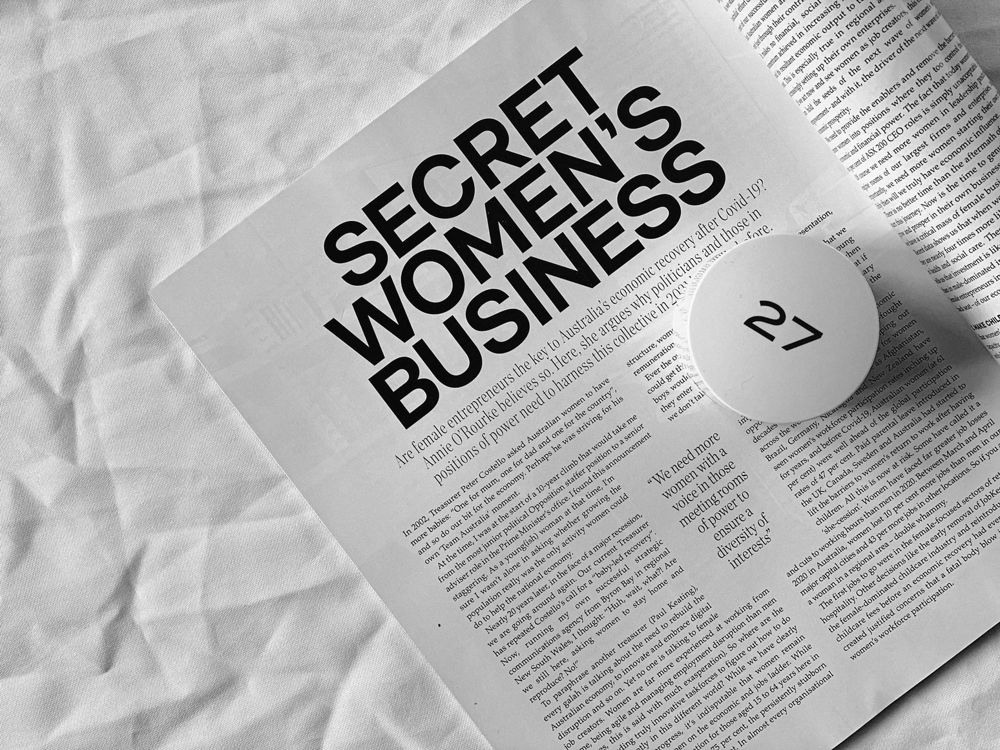
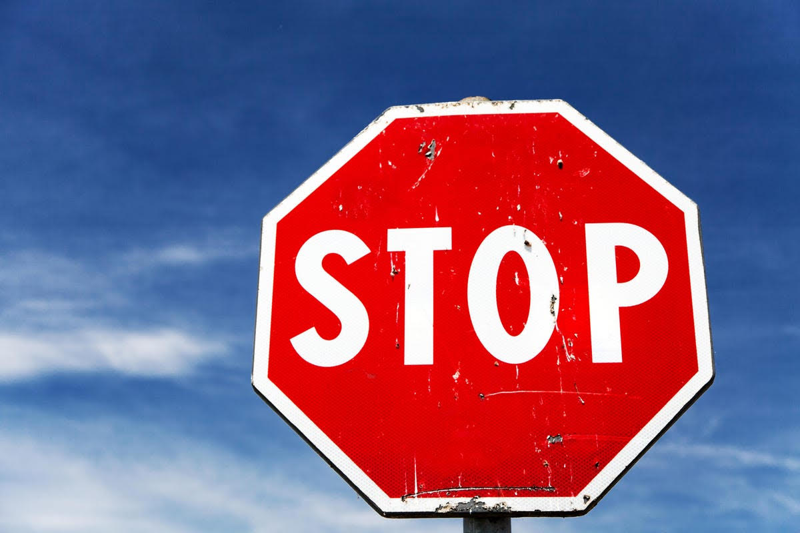
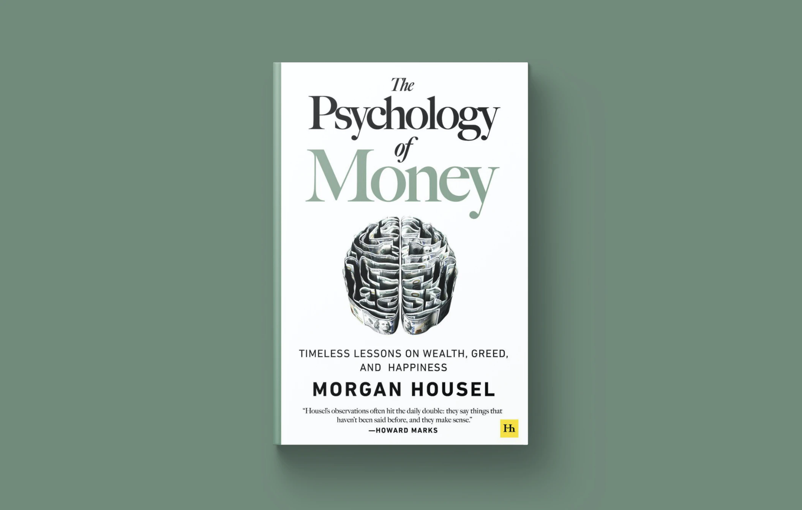

We live among texts. We read books, newspapers, magazines, notice signs, billboards and inscriptions on fences. Every day, by reading texts and perceiving them by ear, we receive a tremendous amount of information. We can reason whether we like or not the sound of unfamiliar words in a foreign language or find mysterious patterns in the letters of an unusual script.

The ability to aesthetically perceive sounds heard in familiar words and think about the word's form are characteristics of poets and writers.

The ability not only to read the text but also to see it, from the general mass to the details of a single letter, to work with it according to its nature and the laws of composition is a distinctive feature of a typographer.The task of a typographer is to develop this ability and use it for the reader's benefit.

The text can be read precisely by quietly turning over page after page in a big book, paying attention only to the meaning. The text for continuous reading should be as inconspicuous as possible. Such quality consists of the most familiar form of signs and the gaps between them when the brain catches the meaning of a combination of letters before it reads their forms separately. For the same reason, the reader usually does not notice typos in the text. The general form of the word is preserved, and the person, having understood its meaning, moves on. However, this way, you can confuse words that are different in meaning and similar in form. The reader will most probably see the word that he or she expects in the context.

Also, we can select fragments from the whole text. The violation of the rhythmic structure of the text attracts our attention; systematic highlighting in the text complicates continuous reading but simplifies selective reading. They create a structure and hierarchy that allows you to distinguish different types of information from each other and separate the main ideas. However, the 'accessories' for selective reading are designed for the same conditions as a solid text: standard lighting and a distance of 25-40 cm from the eyes. 

Some texts are intended for perception in non-standard conditions: from a very long distance, with poor visibility, insufficient lighting, or tiny size. These are usually short phrases: warnings, signs, and other elements of visual communication. In such texts, it is not the subconscious understanding of the meaning but the reading of individual signs. Recognizability of the shape of letters is more important here than the general rhythmic structure.

The text in advertisements and posters is designed to create a particular impression on the reader. Such text acts on our consciousness not just as a sequence of letters but as an image. We can say that this is the most visible of all types of text. Even a reader who is far from design and typography usually notices that it is not "just" typed.

Often, the effect of the visibility of the text is achieved by using a decorative font. The typographer must remember that the perception of such fonts is complex, and it is not worth typing long texts.

Another aspect is that image can be made from almost any piece of text. To do the work properly, it is necessary to take away from the reader the possibility of perceiving the text subconsciously and make the text unusual. If a person sees and reads not what he expected, it will definitely stop his attention.

Thus, when interpreting a text, the typographer must necessarily imagine what it is intended for and what kind of perception it is designed for. The design solution must be thought out. The main purpose of the design in typography is to create the shape of the object that most accurately corresponds to its content and purpose.