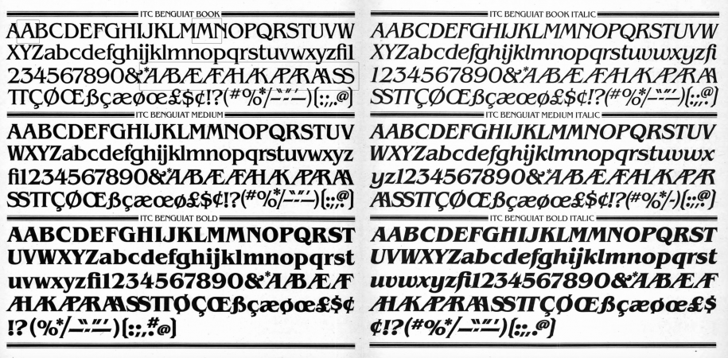

Netflix has already released three seasons of the sci-fi series "Stranger Things". Typography and visual branding are two reasons why you need to get involved in a repeatedly awarded television project.

Many trends from the past have found a new life thanks to this series. In addition to Winona Ryder and the hits of the eighties shown in the Stranger Things series, the audience has developed a love for retro fonts presented in the introductory screensavers. Significant attention was attracted by ITC Benguiat, a decorative serif font designed by the legendary Ed Benguiat and released by the International Font Corporation in 1977.

Matt and Ross Duffer, brothers and creators of the popular TV series, told "Vulture" that choosing the font for the intro screen saver was a "double inspiration." On the one side was the font \[ITC Benguiat], and on the other was a title inspired by old Stephen King books. They sent 12 different old covers to "Imaginary Forces", who developed the titles, as the creators of the series wanted it to be in the style of these novels. They wanted to recreate the memories and feelings from childhood when people opened one of Stephen King's big novels. The Duffer brothers highlighted that they wanted everyone to experience the same feelings when seeing the show, as they experienced in childhood when opening each new chapter of the mystery book.

A disjointed version of the opening intros of Stranger Things sets the tone of the show. The screensaver is filled with a sense of anxiety; the music informs us about the movement of the font when the letters are combining to form a title. The main title, "Stranger Things", simulates an optical view that reflects the show's time period, and it seems that light passes through the film, creating nearly a tactile quality.

The Ed Benguiat font has a long history in show business. It was used on the covers of numerous Stephen King novels of the 1980s, as well as in the Smith album "Strange Ways, Here We Are". Also, we can find it on the covers of books in the "Choose Your Adventure" series and in the logos of the National Assembly of Quebec and the Melbourne Knights. This font is also present in the main titles of the films "Star Trek", "Star Trek Generations", "Star Trek: First Contact" and the video game "Nier: Automata".

Ed Benguiat has created more than 600 font designs and is widely known for his designs or redesigns of logos for "Esquire", "The New York Times", "Coke", "Estée Lauder", and others. Benguiat is no stranger to the entertainment industry. Before "Stranger Things", his designs were decorating the logos of the movie "Planet of the Apes", "Super Fly", and "Guns of Navarone Island". Ed Benguiat is one of the most prolific performers titles in history, and he was included in the Art Directors Hall of Fame in 2000.

\
The intro screensavers are good to date, but it seems that they are becoming more and more complex and trying to outdo each other. Unlike attempts to surpass these unique screensavers, the creators of the series "Stranger Things" returned to the simplicity of screensavers of old masterpieces that we all loved as children. For the viewer, there is something epic about titles like "The Untouchables". This unsurpassed but straightforward ITC Benguiat font is based on Art Nouveau period fonts. It conforms to ITC's formulaic solution regarding extremely high x-height, combined with multiple widths and weights values.

Therefore, we can observe how, at first glance an ordinary and no longer new font, has again reached the peak of its popularity and has become fashionable among a million people in modern society. Only such truly talented masters as Ed Benguiat are able to create a new trend from classical foundations and well-known typographic elements.