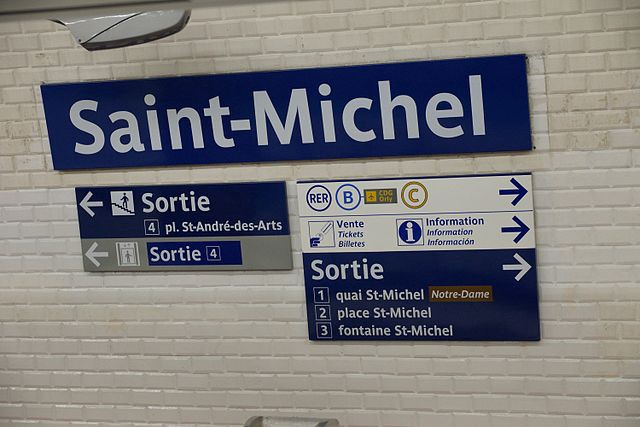
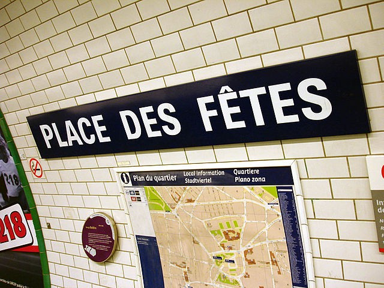
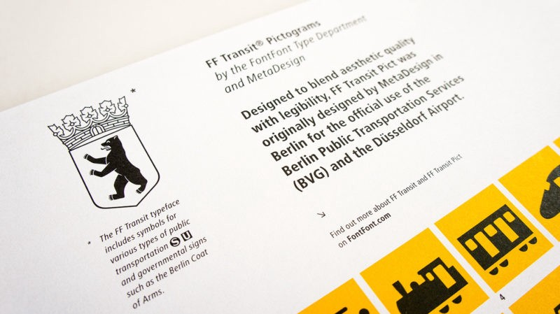
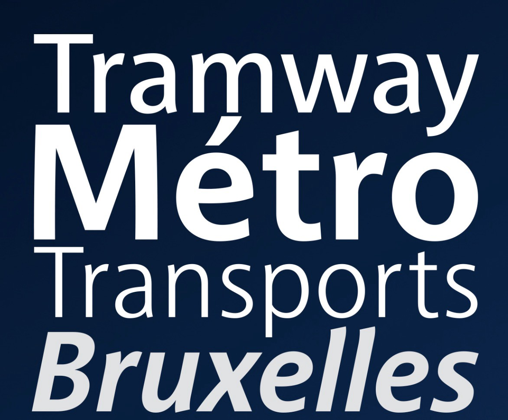
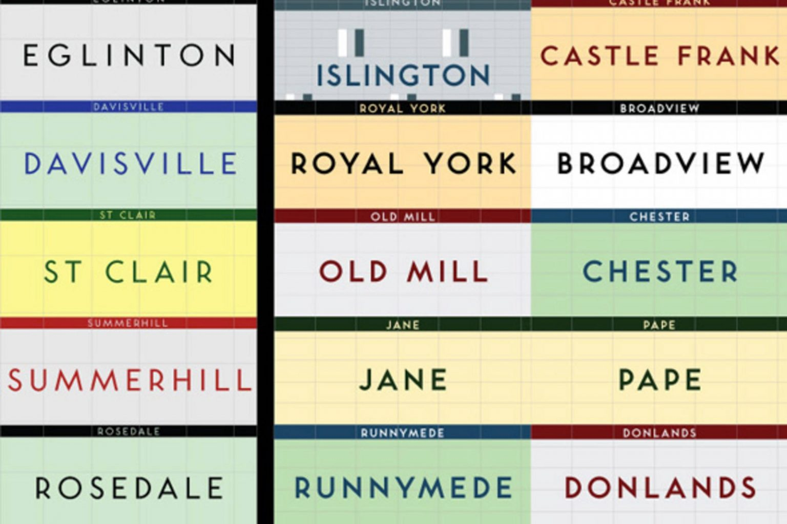
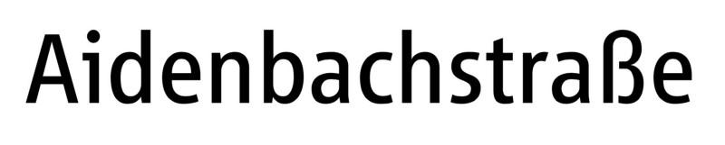
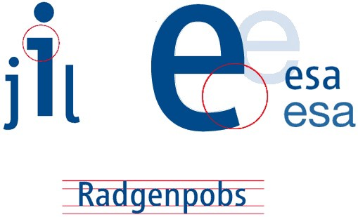

Why does one city feel different from another? Why Paris feels so different from Berlin? Although the answer to this question has been the subject of many books and includes many elements, including socio-economic moments, intercontinental conflicts, history and architecture. We will focus on one particular aspect that plays an important role in defining a city – the metro system. 

Today we will look at examples of several world-famous subways, their design and typography options.

**Paris, France**

Parisine has been the official font of the Paris Metro system since 2015. It is used in the Paris metro, trams and buses of the RER - a rapid public transport system serving Paris and the suburbs. It was developed in late 1996 by Jean-François Porchez.

The construction of the first RER lines in the 1970s meant that more attention was paid to signage. The colours of the station signage on the RER have returned to white text on a blue background with the Univers font. But RATP were not completely satisfied with the result and asked designer Adrian Frutiger (the author of the Univers font) to make a unique version for the subway. He did, although it was decided to use Métro Alphabet only to replace damaged signage or signage that contained outdated information. These signs with all capital letters can still be found all over the metro.

**Berlin, Germany**

The Berlin Metro is already 116 years old. Officially, FF Transit is a BVG (Berlin Public Transport System) font developed by MetaDesign in 1997. Kate Seabrook once described the Berlin subway this way: "It's a genuine underground art gallery."

Depending on which line you are on and how badly it was destroyed during various historical events, you can find different fonts, such as FF Transit, Octopuss, Helvetica and Gothic writing. So, what does Berlin give you? Well, it's a beautiful and seemingly endless journey into the world of fonts. Berlin has separate divisions for its underground and aboveground transport (U–Bahn/S–Bahn), and therefore their visual identity is significantly different. Do not forget that the S-Bahn is about 95 years old, and it would be strange if it did not have a unique design.

**Brussels, Belgium**

The Brussels Metro may be small, but it certainly deserves to have its own particular font. Since 2006, Brussels has been using the Brusseline font, designed by Eric de Berranger, a font designer living in Paris.

This is certainly not Helvetica or Univers: its rounded symbols not only give it a recognizable appearance but also help to avoid the frequent font problem - too similar letters. These small curves help to identify letters at a great distance.

**Toronto, Canada**

The Toronto Transportation Commission opened its subway doors in 1954, and for more than half a century, it has also paid considerable attention to typography.

Toronto Subway is a geometric sans-serif font designed for the first section of the Toronto Subway along Young Street. However, you might think that Helvetica is still the official font of the metro in Toronto: you will be able to find it on the tiles on the walls of some stations. The font was recreated by David Vereshchagin in 2004.

**Munich, Germany**

Munich also has its own font for the transport system called Vialog. It was developed by Fuenfwerken, a division of the Munich Transport Authority, in 2002. However, it was based on forms on Euro Type - an unpublished font, sketches of which were made in 1988.

\
What experts like most about Vialog font is that it has already taken into account the most common problems of legibility, such as easily confused letters I/i, j and J. It also has a sufficient and proportional x-height, which makes it ideal for a short text that needs to be legible in poor conditions.

