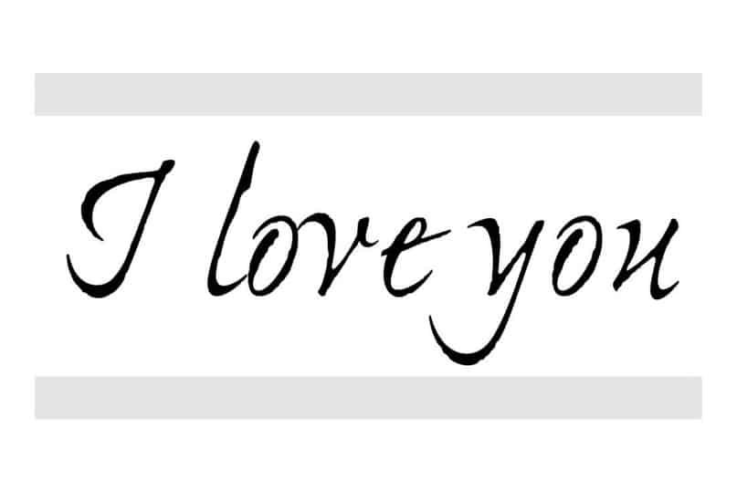
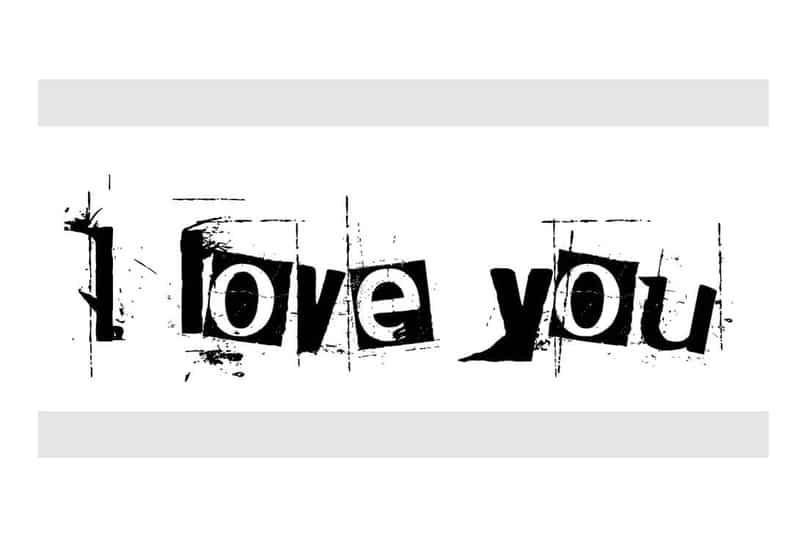
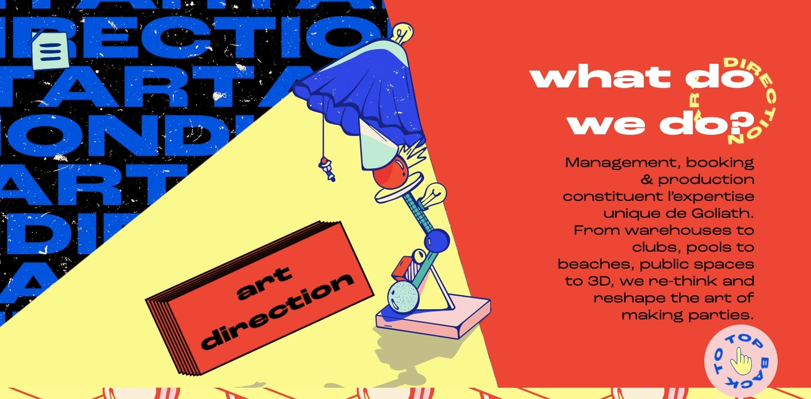

Can such a small thing as a font change the meaning of words or the whole design? Yes, It definitely can. The font can add a new level of understanding to the text and the meaning of the message. This can help you establish contact with the audience, form a brand and set the tone for the whole project. The wrong font can make the design flat, disjointed, or even give users the wrong idea about your brand. Now, with this knowledge, let's look at some typography tips.

***The mood and the message you want to convey must match each other*.**

It may sound surprising, but it's true: each font has its own mood. Furthermore, just like your mood, it can change due to the environment. This happens due to peoples thoughts about the content. However, the arising emotions help to set the specifics of the project. It creates a connection between what you want to reflect, who you are and how people react to you. Creating the right connection starts with understanding what you want your project to be about as well as a bit of knowledge about different font styles and font history.

Compare these messages:

What meaning does this evoke?

Doesn’t this evoke a different meaning?

The only difference here is in the fonts. Do you see how different these messages are?

**Font moods for beginners.**

There is no particular science when matching fonts by mood. In fact, mostly, it happens intuitively, and you just need to look at the font and the word together to understand what meaning they evoke.

Here are some examples to get started with different styles of typography. Serif typeface (Serif) symbolises eternity, formality. New antique (Modern serif): gloss, high fashion. Bar (Slab serif) evokes a sense of importance and attention. Sans serif font: neutral, simple. Bold (Black or bold) is about something important; the stop sign. Handwritten (Script): elegant, characteristic. Geometric evokes a retro mood, something childish. Monospaced: code-based, sharp. Rounded (Bubble or rounded) is a friendly, lively font. Vintage is now associated with something fashionable, cool. Grunge (Grunge): the font is rough, mystical.

**Avoid clichés**

Here's the tricky part: don't fall into the trap of using cliché fonts because of their general association or because you're not sure what to do. You can find lists all over the internet that tell you which font to use for any type of project.

As with any font combination, choose one for the title and big words and something more straightforward for the rest of the text. This combination can be more traditional if you choose serif fonts. In any other cases, try to experiment and follow your inner feelings of how the work should be done. Maybe you will want to mix a serif font with lighter content or make a handwritten font more masculine. 

**Consider the environment**

Think of some simple sans-serif font. Basically, these fonts are pretty neutral and will adapt to the meaning of their environment. An essential part of the perception of a font is what elements surround it. It can be anything from images to other fonts. Different combinations can make the user perceive what they see differently.

**Who is your audience?**

There is another element that you cannot control regarding typography and mood: how your audience perceives your content and font variations.

Let's take Comic Sans, which has been joked about more than once. Most designers won't use it. They will grin and laugh if one of their colleagues creates a project with it. On the other hand, Comic Sans is a popular font. You will find it everywhere - from church bulletins to amateur newspapers and simple signage.

Where you think there is a fundamental design problem, there will always be people who won't see it. The same thing can happen with any font.

The audience will approach the design from different perspectives. Take your audience into account in advance and try to predict how they will perceive the design. What will they think about your choice of typography? Can you make decisions that coincide with what they expect from the project?

**5 fonts that most designers do not use**

Choosing or not choosing a font should not be a sad decision. It happens to us all, when an excellent design has been destroyed by stupid or simply excessive use of the wrong font. Here are five fonts which you should be careful when using, if you want to be a professional and unique typography designer:

1. Papyrus: It is difficult to fit into any design, and at the same time, it has huge problems with readability.\
2. Jokerman: Any font with dots, spikes or swirls often looks too funny.

3. Times New Roman: The default font from text editors and 10th grade exam tests. This is a standard font, but it may have a slight shade of laziness.

4. Impact: If you want to shout to your users: "This is very important, you need to read this now!" then choose it. (It was a perfect font until memes ruined it).

5. Comic Sans: Everything has been said about it above.

**Conclusion**

Your feeling as a designer, the emotions of your audience and the mood of the typography combine to create a collective perception of the work.

When planning a project and working on its creation, do not forget to take into account the mood of your audience. Furthermore, if you stumble along the way - don't worry; it happens. Learn from these mistakes and rethink the process for your next project.