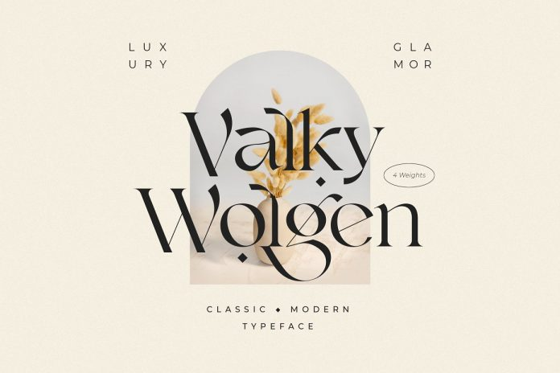
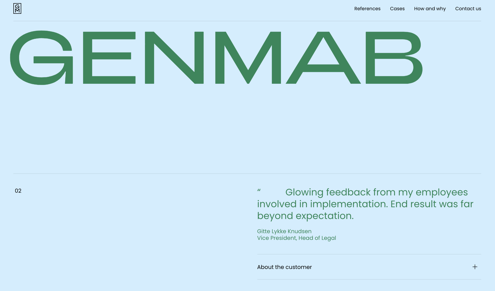

Often, designers do not pay due attention to typography when it is actually a crucial aspect, the choice of which usually changes the quality of design. Fonts are just as important to a website as images.

Typography is not just about choosing a font. 

This is also the stage where you need to think about kerning, tracking and interlinking. Part of typography is also the choice of text colour, text layout, and even page design.

The effectiveness of the message you want to convey with your site often depends on its decoration. A good font attracts the viewer and influences their perception of the idea.

A well-chosen font helps the viewer enjoy reading. It is always necessary to choose the most appropriate font for every situation.

Choosing a suitable typeface is also complicated by the fact that there are a lot of fonts available for use. There isn't any specific rule that helps to choose the right font in all cases, but some principles can be used in a variety of situations and deserve additional attention.

**Legibility is very important.**

\
The font must be legible for the reader to understand what is being discussed. There are many factors to consider when it comes to text legibility. These factors include the size, shape and width of the characters, visual weight, superscript and subscript length, and stroke contrast. Choosing a high-quality font is a good start for creating legible text, but due to the enormous number of different fonts, it can be tough to make a choice.

High-quality fonts are divided into core pairs, making it easy to achieve the desired effect. The distance between letters significantly affects the font's legibility, so fonts with too large spaces between characters should be avoided.

**Choosing the right font for the website and using them correctly.**

The typography must attract viewers and keep their attention, so the font should be easy to read, pleasant and neat. Headings and subheadings should attract attention, and the content itself can be highlighted in a certain way using italics, bold font colour or font position.

Font size is also of no minor importance, and this factor should not be neglected when creating a web page design. It is worth giving preference to a larger font since it is easier to read on smaller screen resolutions from tablets, smartphones and laptops.

Combining different typefaces can also be very effective. It is important to remember that the fonts must be sufficiently distinct for the desired effect to be achieved. A good choice would be one serif font and one sans serif font. This creates a contrast that gives the text coherence, especially if they are fonts by the same designer.

**Choosing the right font to print.**

A well-chosen font will help to create a first impression. A well-chosen font combination will help you stand out. At the same time, it does not matter whether it is in a printed form, a business card or just a leaflet.

The font should not overlap the meaning of the text, as this will distract from the information you want to convey. The purpose of the typeface is to simplify the reading of the text, and if you overdo it, the reader will only look at the font, not perceiving the text itself.

It is also necessary to pay attention to contrast and brightness when printing. Make sure that the font looks the same as on the screen. This will help the designer determine whether the desired effect is achieved with the help of the selected typeface or not.

\
**Conclusion.**

The main aim of the font choice is to attract viewers. The goals of the work should always be clearly defined and aimed at the target audience. You should also not forget about the age category and the audience's interests.

Projects for an audience interested in modern technology, for example, have their own requirements. The typeface used in this case will be current: the choice can be between angular or smooth fonts. Fonts are not bad or good. It would be correct to say that they are suitable or unsuitable. The typeface should not be selected until it becomes clear who will read the text and what should be conveyed to the audience.